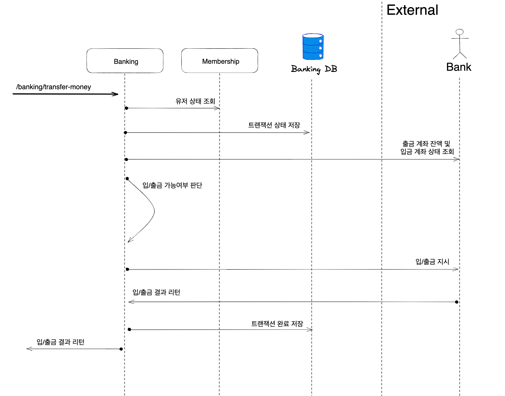

# Payment-Service

MSA와 SAGA 패턴 학습을 위한 결제 서비스

MSA 및 SAGA 관련 기술 학습이 위주라서 대부분의 테스트 코드는 생략하였습니다.

## Architecture

아래의 서비스로 구성되어 있습니다.
- 회원(Membership)
- 뱅킹(Banking)
- 머니(Money)
- 송금(Remittance)
- 결제(Payment)
- 정산(Sattlement)

#### 입/출금 요청

#### 머니 충전 요청

#### 송금 요청

#### 결제 요청

#### 정산 요청

## Sample Screenshots

## 강의

- https://fastcampus.co.kr/dev_online_projectmsa